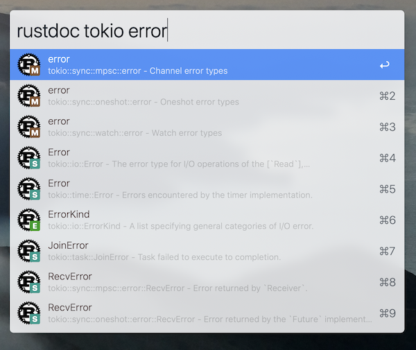

Alfred-rustdoc
==============

An Alfred workflow for searching Rust crate documentations on docs.rs. It uses
the search index file built during `cargo doc` to generate typeahead list in
Alfred, and it opens docs.rs for you.



It supports the same query syntax in `cargo-doc`. For example, you can use `fn:`
to priortize functions in the search result, or use `vec -> usize` to search all
the functions that accepts a `Vec` as parameter and returns an `usize`. For
details, please read the "search tricks" section from `cargo doc` (press "h" in
any documentation generated by `cargo doc`):

> Prefix searches with a type followed by a colon (e.g., fn:) to restrict the
>search to a given type.
>
>Accepted types are: fn, mod, struct, enum, trait, type, macro, and const.
>
>Search functions by type signature (e.g., vec -> usize or * -> vec)
>
>Search multiple things at once by splitting your query with comma (e.g., str,u8
>or String,struct:Vec,test)
>
>You can look for items with an exact name by putting double quotes around your
>request: "string"
>
>Look for items inside another one by searching for a path: vec::Vec

Installation
============

This workflow requires you have NodeJS installed in your system. To install
NodeJS, run (w/ Homebrew):

```
brew install node
```

Then download the .alfredworkflow file from the [Release][release] page.

If you want the workflow to use a copy of NodeJS that is not located at
`/usr/local/bin/node`, please configure the environment variable
`ALFRED_NODE_PATH` in Aflred to your copy of NodeJS.

[release]: https://github.com/fanzeyi/alfred-rustdoc/releases

Details
=======

This project directly uses the [`initSearch`][initSearch] function in
[rust-lang/rust][rust] (hence written in NodeJS) with some stubs to make it work
outside the browser. Then it fetches the `search-index.js` file generated during
the documentation building process (`cargo doc`) from docs.rs to serve the
search result in Alfred. **The search-index.js is evaluated inside a sandbox
provided by [vm2][vm2]. This means this workflow will be running code downloaded
from the Internet inside a sandbox.** This is really unfortunate since some big
crates rely on some JavaScript features to do compression (for example, [this
search index file][nom-search-index]). Please let me know if there is an
alternative way to acquire the search index without actually executing any
remote code. 

[initSearch](https://github.com/rust-lang/rust/blob/master/src/librustdoc/html/static/main.js#L528)
[rust](https://github.com/rust-lang/rust)
[vm2](https://github.com/patriksimek/vm2)
[nom-search-index](https://docs.rs/nom/5.0.1/search-index-20190820-1.39.0-nightly-bea0372a1.js)

License
=======

MIT
